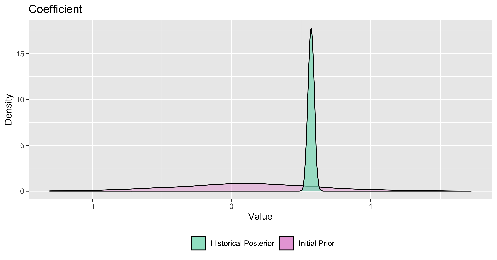
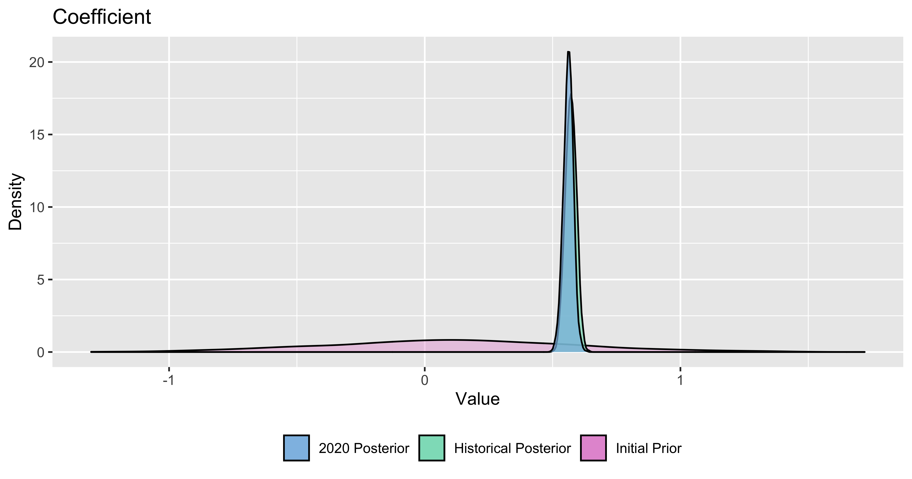
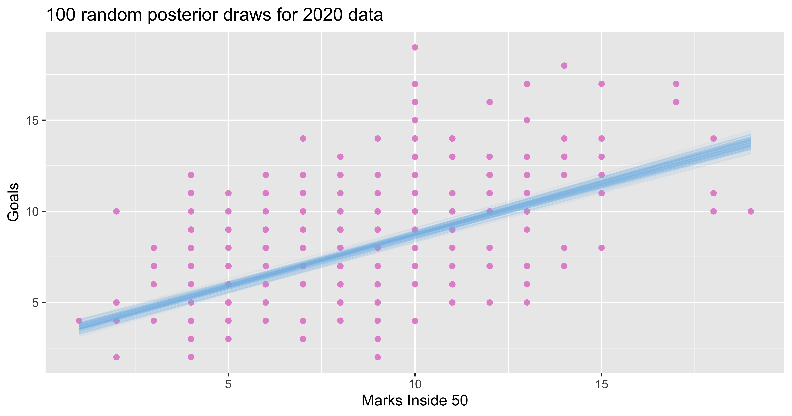

Basic principles of Bayesian inference and its analytical workflow
========================================================
author: Trent Henderson
date: 16 July 2021
autosize: true
css: corp-styles.css
transition: linear

Goals of the presentation
========================================================
class: small-code

This interactive talk aims to help you achieve four things:

* Understand the fundamentals of Bayes rule and how to apply it
* Understand how the Bayesian approach to statistical inference fits within the open science framework
* Understand the available software tools to carry out Bayesian analysis
* Understand what a basic end-to-end Bayesian analysis workflow looks like

All the code for today is in a [GitHub repository](https://github.com/hendersontrent/bayes-workflow-pres).

Activity: Our prior beliefs
========================================================

## Consider the following question:

**What proportion of all university students in Australia are studying at a Group of Eight university?**

* 0.2
* 0.3
* 0.4

Pop your answers in the Zoom chat!

Activity: Our prior belief
========================================================
class: small-code

Since we have a few values that are close together, we believe that the **true** proportion could be most likely somewhere around 0.3 but with some variability. We can model this uncertainty using a distribution. `Beta` distributions are ideal for proportion outcomes.

Activity: A sample of data
========================================================
class: small-code

Now let's say we sampled 10 university students and observed whether they were attending a Go8 or not and 5 said they were. These realisations are called the "likelihood". And we can represent them using a `binomial` distribution.

Activity: Combining our belief and the observed data
========================================================
class: small-code

We can multiply our `prior` by the observed data (`likelihood`) to get the `posterior`.

Activity: Updating our beliefs
========================================================
class: small-code

To properly update our beliefs, we need to standardise our posterior so that the total probability equals one. This makes it a proper probability distribution.

Activity: The impact of sample size
========================================================
class: small-code

So far we have used a random sample of 10 students. But what happens if we sample 100 and 50% still said they were at a Go8?

Activity: The impact of sample size
========================================================
class: small-code

How about 1000? As sample size increases, the impact of the prior on the posterior weakens in comparison to the data/likelihood.

The mathematics of Bayesian statistics
========================================================

Bayesian statistics boils down to [Bayes's Theorem](https://en.wikipedia.org/wiki/Bayes%27_theorem):

$P(\theta \mid D) = \frac{P(D \mid \theta) \cdot P(\theta)}{P(D)}$

Let's break it down formally:

$P(\theta \mid D)$ - this is called the **posterior** (probability of model parameters given the data)

$P(D \mid \theta)$ - this is called the **likelihood** (probability of the data given model parameters)

$P(\theta)$ - this is called the **prior** (our expressed understanding of the probability of model parameters)

$P(D)$ - this is called the **marginal likelihood** (probability of the data)

Mathematical complications
========================================================

The **marginal likelihood** (denominator in Bayes Theorem) is the reason we can't just compute complex Bayesian models easily - it involves summing (integrating) over all the possible values of the distributions. In a trivial single number case it is easy to just add the numbers, but when using higher-dimensional models and complicated prior and likelihood distributions, this becomes analytically intractable

To get around this, we instead employ sampling algorithms, such as [Markov chain Monte Carlo (MCMC)](https://en.wikipedia.org/wiki/Markov_chain_Monte_Carlo), to simulate a large number of times to approximate the posterior distribution instead.

Benefits of a Bayesian approach to inference
========================================================

* Probabilistic estimates instead of point estimates
* Quantification of uncertainty
* Ability to capture subject matter expertise
* Ability to update models as new data is available
* Simulation can help address limitations with small N
* No *p*-values
* Does not condition on an unobservable null hypothesis. Instead conditions on the data you have observed.

Common criticisms of Bayesian inference
========================================================

* Computation time
* Subjectivity of priors
* Sampling issues with MCMC

Connection to Registered Report format
========================================================

A Bayesian framework (while not perfect) protects against a lot of traditional frequentist issues such as *p*-hacking. Bayesian formalism integrates easily into the Registered Reports format as Bayesian inference is largely concerned with transparently *modelling the underlying statistical process that is likely to have generated your data*. This forces researchers to think deeper upfront about study design and analytical methodology, consistent with the RR format. As Bayesian models are probabilistic, incorporation of new data does not lead to problematic behaviour such as *p*-hacking so these study designs can be considered from the start.

The overall workflow
========================================================

Software tools for Bayesian inference
========================================================

Enough serious talk, more AFL!
========================================================

Now that we have the basics, let's take a look at a basic Bayesian regression workflow on some open-source AFL data.

## The premise

**We are going to explore the relationship between the number of marks inside 50 and goals scored in the AFL for the 2020 season using data from prior seasons.**

Example: Prior specification
========================================================
class: small-code

Since I have no real clue how many goals there would be if there were zero marks, I have a really vague (wide) prior for the intercept of $\mathcal{N}(5,1.5)$:

Example: Basic visualisation
========================================================
class: small-code

But I am confident that more marks means more goals, but not 1:1! Might be 10 times as many marks as goals, which means 0.1 as a slope? So here is my vague prior for the regression coefficient.

Example: Initial Bayesian model fit
========================================================
class: small-code

After fitting the model, we can compare our prior with the posterior. Here is the intercept.

Example: Initial Bayesian model fit
========================================================
class: small-code

And here is the slope coefficient, which is of much more interest to us.

Example: Using historical posterior as new prior
========================================================
class: small-code

With this information, we can now fit our final model and compare our initial prior, the historical data posterior (which became the 2020 model prior) and the 2020 posterior. We are skipping the intercept here as it is of little interest, so let's just look at the regression coefficient.

Example: Our model against the actual data
========================================================
class: small-code

We can now plot a random sample of draws from our posterior distribution and use the coefficient values to draw regression lines over the actual data.

Final remarks
========================================================

There is much, much more to learn in Bayesian inference and many other ways to evaluate and improve models. This session hopefully served as a primer to either inspire you to learn more, or to at least consider using Bayesian approaches on current/future projects.

Special thanks to Ben Fulcher for providing input on the content of the talk, and [Peter Ellis](http://freerangestats.info) for providing input on the version I originally gave to my firm in early 2021.

**Using Bayes' Theorem doesn't make you a Bayesian. Quantifying uncertainty with probability makes you a Bayesian** - Michael Betancourt
